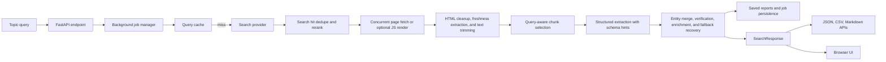

# Architecture

This document describes the runtime architecture, technology stack, major modules, and request lifecycle for Agentic Search.

## System Overview

Agentic Search accepts a topic query, gathers candidate sources from a search backend, fetches and normalizes the resulting pages, extracts comparable entities and attributes from the most relevant text segments, merges overlapping entities across sources, and returns a source-backed result set through a JSON API and browser UI.

## Technology Stack

| Layer | Technology | Version | Role |
| --- | --- | --- | --- |
| Runtime | Python | project runtime | Application runtime |
| Web API | `fastapi` | `0.115.12` | HTTP routing, response modeling |
| ASGI server | `uvicorn[standard]` | `0.34.0` | Local and production serving |
| HTTP client | `httpx` | `0.28.1` | Search API calls and page retrieval |
| HTML parsing | `beautifulsoup4` | `4.12.3` | HTML cleanup and text extraction |
| Extraction client | `openai` | `1.107.2` | Structured extraction requests |
| Validation | `pydantic` | `2.11.3` | Typed models for hits, pages, entities, and responses |
| Settings | `pydantic-settings` | `2.8.1` | Environment-driven configuration |
| Frontend | Vanilla HTML, CSS, JavaScript | bundled | UI rendering and request handling |

## Repository Map

| File | Primary responsibility |
| --- | --- |
| `app/main.py` | Process-wide pipeline lifecycle, middleware, routes |
| `app/config.py` | Environment-backed application settings |
| `app/cache.py` | Generic TTL cache used by runtime components |
| `app/persistent_cache.py` | SQLite-backed cache persistence across process restarts |
| `app/reports.py` | Markdown rendering and saved report snapshot storage |
| `app/job_store.py` | File-backed persistence for background job state |
| `app/jobs.py` | Background job orchestration and progress reporting |
| `app/rate_limit.py` | In-process API rate limiter |
| `app/resilience.py` | Shared circuit breaker logic for upstream integrations |
| `app/enrich.py` | Post-extraction enrichers such as GitHub metadata |
| `app/export.py` | Export serializers for flat downstream formats |
| `app/models.py` | Shared request, extraction, and response schemas |
| `app/search.py` | Search provider clients and search-hit normalization |
| `app/scrape.py` | Page fetching, HTML cleanup, chunk generation |
| `app/extract.py` | Structured extraction client and retry fallback |
| `app/pipeline.py` | End-to-end orchestration, scoring, and merge logic |
| `app/static/index.html` | Browser interface, rendering, and client-side caching |
| `tests/test_performance_helpers.py` | Unit coverage for helper-level performance logic |

## Runtime Components

### `app/main.py`

Important functions:

- `get_pipeline()`
  Creates a single shared `AgenticSearchPipeline` instance and reuses it across requests.
- `shutdown_event()`
  Closes persistent HTTP and extraction clients during application shutdown.
- `search()`
  Handles `GET /api/search`, delegates to the pipeline, and translates runtime errors into HTTP responses.
- `search_csv()`
  Returns a flat CSV export of the same response payload used by the JSON endpoint.
- `search_markdown()`
  Returns a Markdown report rendered from the same structured response.
- `create_job()` and `get_job()`
  Expose background query execution and progress polling for long-running searches.

## `app/config.py`

Important component:

- `Settings`
  Defines provider credentials, extraction limits, page-processing limits, cache TTLs, and concurrency controls.

## `app/cache.py`

Important class:

- `TTLCache`
  In-memory cache with size bounds, TTL-based eviction, and thread-safe reads and writes.

Important methods:

- `get(key)`
  Returns a cached value when present and not expired.
- `set(key, value)`
  Inserts or refreshes a cached value and evicts older entries when the cache exceeds its size limit.

## `app/persistent_cache.py`

Important class:

- `PersistentCache`
  SQLite-backed cache store for query, search, page, and extraction payloads that should survive process restarts.

## `app/search.py`

Important classes:

- `BaseSearchProvider`
  Owns a persistent `httpx.AsyncClient` and a search-result cache.
- `BraveSearchProvider`
  Calls the Brave Search API and maps results into `SearchHit` models.
- `SerpAPISearchProvider`
  Calls SerpAPI and maps organic search results into `SearchHit` models.

Important functions:

- `_canonical_url(url)`
  Normalizes URLs to reduce duplicate hits.
- `_dedupe_hits(hits, limit, per_domain_cap)`
  Removes duplicate URLs and limits repeated domains before scraping begins.
- `build_search_provider(settings)`
  Instantiates the configured provider.

## `app/scrape.py`

Important class:

- `ScrapeService`
  Owns the page-fetch `httpx.AsyncClient`, the page cache, and concurrent fetch execution.

Important functions:

- `_clean_text(html)`
  Removes low-value tags and converts HTML into normalized plain text.
- `chunk_text(text, chunk_size, overlap, max_chunks, query)`
  Produces a bounded set of chunks and prioritizes segments that overlap with the query.
- `fetch_page(hit)`
  Retrieves an individual page and falls back to the search snippet when the page is unavailable or non-HTML.
- `scrape_hits(hits)`
  Fetches pages concurrently up to the configured concurrency limit.

## `app/extract.py`

Important class:

- `LLMExtractor`
  Owns the extraction client and chunk-level extraction cache.

Important functions:

- `_request_extraction(user_prompt)`
  Executes a structured extraction request and validates the model response into `ChunkExtraction`.
- `extract_from_chunk(query, page, chunk)`
  Resolves the cache, performs the primary extraction request, and retries with a shorter fallback prompt if parsing fails.

## `app/pipeline.py`

Important class:

- `AgenticSearchPipeline`
  Coordinates all search, scrape, extraction, merge, ranking, and response assembly steps.

Important methods:

- `run(query, debug=False)`
  Main request entrypoint. Builds a dynamic run plan, checks the query cache, performs the full pipeline, emits progress callbacks, and returns timing metrics.
- `_filtered_pages(pages)`
  Drops short or duplicate page bodies before extraction.
- `_verify_rows(query, profile, plan, rows)`
  Runs a lightweight second-pass verifier on weak or top-ranked rows.
- `_enrich_rows(plan, rows)`
  Applies post-processing enrichers such as GitHub metadata.
- `_build_columns(rows, profile)`
  Orders attributes using query-type-aware comparison priorities.
- `_page_chunk_budget(source_rank)`
  Limits chunk volume per source so higher-ranked pages receive more extraction budget.
- `_extract_pages(query, pages)`
  Schedules chunk-level extraction concurrently.
- `_merge_extractions(extractions)`
  Merges duplicate entities, consolidates attributes, deduplicates sources, and computes aggregate scores.
- `_augment_rows_with_fallback(query, pages, rows)`
  Adds source-backed fallback entities and vertical-specific attributes when extraction is sparse.

## `app/static/index.html`

Important browser functions:

- `runSearch(query)`
  Starts a background job, polls progress, reuses previews when available, updates UI state, and stores session-level cached responses in the browser.
- `renderSummary(data)`
  Renders response metrics such as entities, sources, latency, and chunk count.
- `renderComparison()`
  Builds side-by-side entity comparison cards using query-aware comparison fields.
- `renderShortlist()`
  Renders pinned entities for shortlist-style browsing.
- `loadReports()`
  Loads recent saved reports and renders Markdown/JSON snapshot links.
- `renderDesktopTable(data)`
  Builds the full desktop table view.
- `renderMobileCards(data)`
  Builds the mobile-friendly card layout.
- `renderSourceList(sources)`
  Renders collapsible citations for each cell.

## Request Lifecycle

1. The browser or client starts either a direct request or a background job for `query=...`.
2. `app/main.py` routes the request through request logging, rate limiting, and the shared `AgenticSearchPipeline`.
3. `AgenticSearchPipeline.run()` classifies the query, builds a run plan (`fast`, `balanced`, or `deep`), checks the in-memory and persistent query caches, and emits progress updates.
4. On a cache miss, the configured search provider returns normalized `SearchHit` entries.
5. Search hits are deduplicated, reranked by query type, and capped per domain before scraping.
6. `ScrapeService.scrape_hits()` fetches candidate pages concurrently, retries transient failures, optionally uses a JS-render fallback, and normalizes HTML into plain text.
7. The pipeline removes duplicate or low-signal page bodies and assigns chunk budgets by source rank.
8. `chunk_text()` selects the most query-relevant segments from each page.
9. `LLMExtractor.extract_from_chunk()` converts each chunk into typed entity and attribute candidates, with cache support, schema hints, and a compact fallback retry path.
10. If extracted rows are sparse, the pipeline augments the response with heuristic fallback entities and vertical-specific attributes derived from strong pages.
11. `_merge_extractions()` combines overlapping entities, resolves attribute winners, attaches ranking signals, and ranks final rows.
12. `_verify_rows()` optionally validates weak or top-ranked rows using a second LLM pass.
13. `_enrich_rows()` applies post-processing enrichers such as GitHub metadata for open-source queries.
14. A report snapshot is optionally persisted to disk as JSON and Markdown, and job state is persisted separately.
15. The API returns a `SearchResponse` containing query type, run mode, comparison fields, rows, source counts, report ID, and performance metrics.
16. The frontend renders progress state, filters, shortlist cards, comparison cards, export actions, shareable queries, a desktop table, mobile cards, and recent saved reports from the same payload.

## Caching Strategy

| Cache | Owner | Key shape | Purpose |
| --- | --- | --- | --- |
| Query cache | `AgenticSearchPipeline` | `(normalized_query, debug)` | Returns repeated queries without recomputing the pipeline |
| Search cache | `BaseSearchProvider` | `(normalized_query, limit)` | Avoids repeated search API calls |
| Page cache | `ScrapeService` | `normalized_url` | Reuses fetched and cleaned page bodies |
| Extraction cache | `LLMExtractor` | `(model, normalized_query, normalized_url, chunk_hash)` | Reuses chunk-level extraction output |
| Persistent cache | `PersistentCache` | namespace plus hashed key | Preserves query, search, page, and extraction artifacts on disk |
| Job state | `SearchJobManager` | `job_id` | Tracks background progress and stores the final result |
| Browser session cache | `index.html` | `normalized_query` | Preserves the last response in the current browser session |

## Data Contracts

Key Pydantic models in `app/models.py`:

- `SearchHit`
  Normalized search result metadata.
- `ScrapedPage`
  Cleaned page body plus fetch metadata.
- `ChunkExtraction`
  Structured extraction output for one text chunk.
- `OutputEntity`
  Final merged entity row returned to clients.
- `SearchMetrics`
  Timing and cache metadata surfaced to the frontend and API consumers.
- `SearchResponse`
  Top-level API payload for `/api/search`.

## Performance Controls

The following settings have the largest runtime impact:

- `MAX_PAGES_TO_SCRAPE`
  Caps how many search hits advance to scraping.
- `MAX_CHUNKS_PER_PAGE`
  Caps how many text segments per page are sent to extraction.
- `MAX_PAGE_TEXT_CHARS`
  Trims very large pages before chunking.
- `MAX_RESULTS_PER_DOMAIN`
  Reduces domain repetition early in the pipeline.
- `MAX_CONCURRENCY`
  Controls concurrent page fetches and extraction work.
- `*_CACHE_TTL_SECONDS`
  Adjusts how long query, search, page, and extraction outputs remain reusable in memory.

## Known Constraints

- Client-rendered pages may produce limited text without a browser-rendering fallback.
- Query cache and other caches are process-local and not shared across instances.
- Cold-run latency is dominated by upstream provider and extraction response times.
- Entity deduplication is primarily name-based and may miss some aliases.
- Persistent cache is local to the configured SQLite database and is not a distributed cache.
